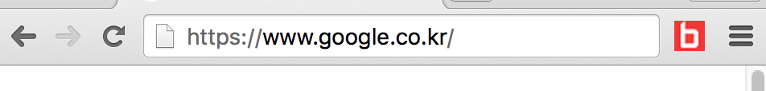

# BuzzAd 웹 연동 가이드 v3.2


## 1. Javascript 연동
 광고를 통해 랜딩 시, BuzzAd 서버에서는 유저의 액션을 트래킹하기 위한 id인 ‘bz_tracking_id’를 원래의 랜딩 url에 파라미터로 붙여서 전달한다. '초기화' 로직을 통해 이 파라미터를 유저의 웹브라우저 내에 광고주 도메인 localStorage에 저장하고, '액션 달성 전송' 로직을 통해 액션 완료 시 BuzzAd 서버로 신호를 보낼 때 저장된 ‘bz_tracking_id’를 꺼내어 같이 전달한다. 이 파라미터의 유무를 통해 BuzzAd 서버에 전송된 액션 달성 신호가 광고를 통해 발생한 것인지 아닌지를 구별할 수 있다.
##### 주의사항
랜딩 페이지와 액션 완료 페이지의 도메인은 동일해야 한다.

### Step1 : 초기화
BuzzAd를 통해 랜딩되는 광고주의 첫 페이지에서 아래의 자바스크립트 코드를 호출한다. ‘bz_tracking_id’ 라는 파라미터가 현재 url의 검색 쿼리 부분에 있다면 이를 localStorage 에 BuzzAd 라는 이름으로 저장한다.

```javascript
<script>
	if (/bz_tracking_id/.test(location.search)) { localStorage.BuzzAd = location.search }
</script>
```

### Step2 : 액션 달성 전송
액션 달성시 아래의 자바스크립트 코드를 호출한다. 앞서 저장한 BuzzAd 라는 이름의 변수를 그대로 불러 와서 서버로 전송한다. 이 값을 통해 유저가 광고를 통해 참여하고 액션을 완료했음을 BuzzAd 서버로 전달하여 적립금을 지급할 수 있게 된다.
```javascript
<script>
(function (img) { img.onload = function () {
	var length = localStorage.BuzzAd.length;
    if(localStorage.BuzzAd.substring(length-29, length) == "10023_71ffbffd-ccf1-4edf-9c4c"){ alert("Action Completed!"); };
    //*필요시 여기서 리다이렉트 수행*
};
if (localStorage.BuzzAd == null) { localStorage.BuzzAd = ""; }
img.src = "//t.buzzad.io/action/pb/cpa/default/pixel.gif" + localStorage.BuzzAd; }) (new Image())
</script>
```
 
##### 주의사항
액션 달성 후 바로 다른 페이지로 리다이렉트를 수행하는 경우, 반드시 BuzzAd 서버에 액션 달성 리퀘스트가 완료되었음을 확인한 후 리다이렉트를 수행하여야 한다. 액션 전송이 완료되면 호출되는 ‘img.onload’ 를 이용하여 리다이렉트를 수행하도록 수정함으로써 안전하게 리다이렉트를 처리할 수 있다. ‘img.onload’에 정의된 익명 함수 안에서 리다이렉트를 수행하도록 연동코드를 수정한다(위의 코드 안의 주석 위치). 이 함수는 BuzzAd를 통해서 광고에 참여하지 않은 유저들에게도 정상적으로 호출이 되는 함수이므로 별도의 상황 구별은 필요하지 않다. 위의 코드 밖에서 리다이렉트를 수행할 경우 BuzzAd서버로 액션 달성 리퀘스트가 오지 않을 수 있으므로 주의한다.

## 2. Javascript integration test
##### 주의사항
웹 브라우저로 Chrome을 사용해야 테스트가 가능하다.
### (1) 테스트용 Chrome extension 설치
1. [Chrome web store 링크](https://chrome.google.com/webstore/detail/buzzad-cpa-test/bocbmmdieplllmldcnececpidlgehdfc)에 접속한다.
2. 'BuzzAd CPA test' extension이 로드되면 오른쪽 위의 'Chrome에 추가' 버튼을 누른다.
3. 팝업창이 뜨면 '확장 프로그램 추가' 버튼을 누른다.
4. 다음과 같이 테스트용 버튼이 브라우져에 추가된다.



**참고** 'chrome://'으로 시작하는 url(chrome web store)에서는 작동하지 않는다.

### (2) 테스트용 랜딩 url 생성 후 호출
아래의 테스트용 bz_tracking_id 를 랜딩 url에 붙여서 호출한다. 여기서 생성한 랜딩 url은 연동 완료 후 BuzzAd 측으로 전달하는 url이 아니라, 광고주 측 개발자의 연동 테스트를 위해 광고가 클릭되어 광고주 페이지로 랜딩 되는 과정을 모의로 재연한 것이다.

case 1. 기존 url에 이미 파라미터가 존재할 경우
`&bz_tracking_id=10023_71ffbffd-ccf1-4edf-9c4c`
> eg) 랜딩 url이 http://ADdomain.com/event/?user=1009 인 경우
`http://ADdomain.com/event/?user=0223&bz_tracking_id=10023_71ffbffd-ccf1-4edf-9c4c`

case 2. 기존 url에 파라미터가 존재하지 않을 경우
`?bz_tracking_id=10023_71ffbffd-ccf1-4edf-9c4c`

> eg) 랜딩 url이 http://ADdomain.com/event/ 인 경우
`http://ADdomain.com/event/?bz_tracking_id=10023_71ffbffd-ccf1-4edf-9c4c`

광고주의 랜딩 url이 해당되는 경우에 알맞게 테스트용 랜딩 페이지를 생성한 후 호출한다.

##### 주의사항
**완료 후 최종 테스트를 BuzzAd 담당자가 진행하게 되는데, 여기서 생성한 url을 다시 BuzzAd 측으로 전달할 필요는 없다**. BuzzAd 담당자가 최종 연동 테스트를 할 때는 이와 달리 실제 환경에서 실제 트래킹 아이디를 이용해서 적립금 지급 테스트를 진행하게 되므로 기존의 url을 전달해야 한다. 실제 환경에서 bz_tracking_id 는 클릭 시마다 달라지는 값이 들어가며, url에 별도의 파라미터로 bz_tracking_id를 넣을 필요는 없다.

### (3) 초기화 단계 연동 확인
Step1의 초기화 단계가 완료되었는지 확인하기 위해 설치한 extension의 버튼을 눌러 실행시킨다. "Step1 success!"라는 메세지가 뜨면 1단계 연동이 성공한 것이므로 (4)번으로 진행을 한다.

### (4) 액션 완료 단계 연동 확인
(3)번이 완료되면 이어서 광고 참여를 진행한다. 의도했던 액션 완료 시점에서 "Action Completed!" 라는 alert가 떠야 한다. 해당 alert가 뜨지 않거나, 의도하지 않은 시점에 호출되는 경우를 주의해야 한다. 사전에 약속된 정확한 액션 완료 시점에서 BuzzAd서버에 신호가 도달해야 적립금이 지급될 수 있다.

##### 주의사항
"Action Completed!" alert는 테스트용 bz_tracking_id(10023_71ffbffd-ccf1-4edf-9c4c)를 사용할 때에만 활성화되는 알림이다. 일반 유저에게는 나가지 않으므로 제공되는 스크립트를 추가적으로 조작할 필요는 없다.

## 3. Server to Server 연동 (Javascript 연동시 불필요)
 
### (1) 액션 달성 API
사용자가 특정한 액션을 수행하면 BuzzAd 서버로 액션이 수행 되었음을 알려주어야 한다. 연동은 다음과 같이 수행한다.
 
1) 요청 방향
광고주 → 매체사
 
2) HTTP Request method
POST or GET
 
3) HTTP Request URL

https://t.buzzad.io/action/pb/cpa/default/

4) HTTP Request parameters

| Field | Type | Description |
| --- | --- | --- |
| `bz_tracking_id` | String | 광고와 유저 트래킹을 위한 아이디. BuzzAd에서 광고와 연결된 URL로 전환시 같이 전달되는 값이다. 광고 웹 사이트는 이 값을 보관하였다가 액션 달성 API호출 시 다시 전달해주어야 한다. |
 
5) Response
JSON 형식으로 반환
		
| Field | Type | Description |
| --- | --- | --- |
| `code` | Integer | 처리결과 코드 - 200 : 정상, 9020 : 중복 요청, 그 외 : 에러 |
| `msg` | String | 처리결과 메세지 |
 
6) Test bz_tracking_id
bz_tracking_id = 10023_71ffbffd-ccf1-4edf-9c4c
 
eg)
https://t.buzzad.io/action/pb/cpa/default/?bz_tracking_id=10023_71ffbffd-ccf1-4edf-9c4c

## 4. 가이드 변경 이력
 
### (1) 변경 이력
| 버젼 | 변경일자 | 변경내용 | 담당자 |
| --- | ------ | -------|------|
|1.0|2013/07/29|-		|서주은|
|1.1|2013/08/01|-		|서주은|
|1.2|2014/01/08|- Test campaign_key, session_key 명시|서주은|
|2.0|2014/07/03|- Javascript를 이용한 연동 매뉴얼 추가|서주은|
|2.1|2014/07/16|- Javascript코드 복사 붙여넣기 문제 수정|서주은|
|2.2|2014/07/17|- Javascript코드 버그 수정|서주은|
|3.0|2014/11/03|- Adfit으로 서버 교체|서주은|
|3.1|2014/12/13|- buzzad.io로 도메인 변경, - 부연 설명 추가, - 액션 달성전송 Javascript 코드 수정|서주은|
|3.2|2016/01/21|- 부연 설명 추가, - Javascript 연동 테스트용 구글 익스텐션 추가|홍서정|
  
### (2) 개요
- 서비스명: BuzzAd
- 회사명: (주)버즈빌
- 담당: 홍서정 매니저 / <haley.hong@buzzvil.com>
