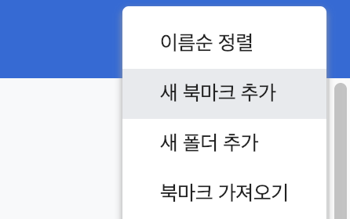

# BuzzAd 웹 연동 가이드 v3.3

Javascript 를 이용한 연동과 Server to Server 연동이 있다. 두 가지 방식 중 상황에 맞게 하나를 선택해서 연동 작업을 진행하면 된다.

## 1. Javascript 연동

### 개요
제공되는 두 종류의 Javascript 코드를 두 단계에 걸쳐 삽입함으로써 연동을 완료할 수 있다. 첫번째 단계(초기화)는 광고의 첫 페이지(랜딩 페이지)가 로드될 때, 두번째 단계(액션 달성 전송)는 액션이 완료 되었을 때에 호출하도록 한다.

#### 주의사항
- Javascript 연동은 localStorage 를 이용하기 때문에 랜딩 페이지와 액션 완료 페이지의 도메인이 반드시 동일해야 한다. 그렇지 않을 경우, Server to Server 연동을 진행해야 한다.
- 반드시 제공되는 연동 테스트까지 완료한 후에 버즈빌 담당자에게 연동 완료 회신을 해야 한다.
- 연동 테스트가 실패했을 경우, 실패한 단계의 FAQ를 참고한다.
- 연동 테스트는 Step1을 성공한 후에 Step2를 진행한다. 

#### 광고 포인트 지급 Flow


- BuzzAd의 인벤토리를 통해서 유저가 광고주의 광고로 랜딩하여 들어올 때, BuzzAd 서버에서는 유저의 액션을 트래킹하기 위한 id인 `bz_tracking_id` 를 원래의 랜딩 url에 파라미터로 붙여서 전달한다. 

    > 주의 : `bz_tracking_id` 는 광고마다 부여되는 고정된 값이 아니라, 유저의 클릭 때마다 매번 달라지는 값이다.

- Step1 '초기화' 단계 연동을 통해 이 파라미터를 유저의 웹브라우저 내에 광고주 도메인 localStorage에 저장한다.
- Step2 '액션 달성 전송' 단계의 연동을 통해 액션 완료 시 BuzzAd 서버로 신호를 보낼 때 localStorage에 저장해 둔 `bz_tracking_id`를 꺼내어 같이 전달한다.
- BuzzAd 서버에서는 전달받은 `bz_trackig_id` 값을 이용해 광고에 참여 완료한 유저 정보를 찾아서 해당 유저에게 포인트를 지급한다.

### Step1 : 초기화

BuzzAd를 통해 랜딩되는 광고의 첫 페이지에서 아래의 자바스크립트 코드를 실행한다.

> 아래의 코드는 ‘bz_tracking_id’ 라는 파라미터가 현재 url의 검색 쿼리 부분에 있다면 이를 localStorage 에 BuzzAd 라는 이름으로 저장한다.

```javascript
<script>
	if (/bz_tracking_id/.test(location.search)) { localStorage.BuzzAd = location.search }
</script>
```

#### FAQ
- Q. 코드에 'test' 라는 단어가 있는 것으로 봐서 테스트용 예시 코드 같은데, 연동할 때 변경해서 사용해야 하나요?
    
    > 테스트용 예시 코드가 아니라 정규표현식 중 하나입니다. 스크립트 전체를 그대로 사용해 주세요.

- Q. 분명히 초기화 스크립트를 확실히 넣었고, 스크립트가 실행되는 것 까지 확인하였는데 주어진 테스트를 진행하면 Step1 연동 실패라고 합니다.
    
    > 코드 작업을 진행하신 페이지의 URL이 광고용으로 전달받은 URL과 동일한지 다시 확인해 주세요.<br>광고용으로 전달 받은 랜딩 페이지에서 곧바로 리다이렉트가 일어날 경우 의도치 않게 전달받은 URL이 아닌 다른 페이지에서 코드 작업을 진행하실 가능성이 있습니다.<br>`bz_tracking_id` 는 첫 랜딩 페이지에만 붙어서 전달되기 때문에 주어진 스크립트 코드는 반드시 랜딩 페이지에서 실행되어야 하며, 그렇지 않을 경우 트래킹 아이디 자체가 아예 생성되지 않은 것 처럼 보여서 연동이 실패하였다고 뜰 수 있습니다.<br>만일 이 둘이 다를 경우, 처음에 전달받은 URL 페이지에서 다시 코드 작업을 하시거나 광고에 등록될 URL을 변경하도록 버즈빌 광고 담당자에게 알려주세요.

### Step2 : 액션 달성 전송

광고에서 정의된 액션 달성시(회원가입, 이벤트 참여 등) 아래의 자바스크립트 코드를 실행한다. 

> 아래의 코드는 앞서 저장한 BuzzAd 라는 이름의 변수를 그대로 불러 와서 서버로 전송한다. 이 값을 통해 유저가 광고를 통해 참여하고 액션을 완료했음을 BuzzAd 서버로 전달하여 적립금을 지급할 수 있게 된다.

```javascript
<script>
(function (img) { img.onload = function () {
	var length = localStorage.BuzzAd.length;
    if(localStorage.BuzzAd.indexOf('10023_71ffbffd-ccf1-4edf-9c4c') != -1){
        alert("[Success] Action Completed!");
    };
    //*필요시 여기서 리다이렉트 수행*
};
if (localStorage.BuzzAd == null) { localStorage.BuzzAd = ""; }
img.src = "//t.buzzad.io/action/pb/cpa/default/pixel.gif" + localStorage.BuzzAd; }) (new Image())
</script>
```
#### 주의! 액션 달성 후 리다이렉트를 수행하는 경우
반드시 BuzzAd 서버에 액션 전송이 완료된 후 리다이렉트를 수행하여야 한다. 위의 코드 내 주석이 위치한 부분은 액션 전송이 완료되면 호출되는 함수 내부로서 이 부분에서 리다이렉트를 수행하면 안전하게 리다이렉트를 처리할 수 있다.

> 코드의 함수는 BuzzAd를 통해서 광고에 참여하였는지 여부에 상관없이 언제나 호출되므로 별도의 위치에서 리다이렉트를 처리할 필요는 없다. 오히려 임의로 별도의 위치에서 리다이렉트를 수행할 경우 BuzzAd 서버로 액션 달성 전송이 아예 오지 않을 수 있으므로 주의해야 한다.

#### FAQ
- Q. Step2 액션 달성 전송 부분의 코드에서 alert 를 보내도록 되어 있는 것 같은데, 일반 유저들에게는 이 alert를 보여주고 싶지 않습니다. 코드를 수정해야 하나요?
    
    > 해당 alert는 테스트를 하실 때만 보이게 되어 있습니다. 코드를 수정하지 않으셔도 일반 유저들에게는 나가지 않습니다.

- Q. 액션 완료 시 삽입한 코드가 확실히 실행되는 것을 확인했는데 테스트 결과 아무런 alert 가 발생하지 않아서 연동이 실패한 것 같습니다.

    > 1) 우선, 액션 완료 페이지와 랜딩 페이지 간에 도메인이 달라지지 않았는지 확인해주세요(http/https 포함).<br> 2) 도메인이 동일하다면, 리다이렉트나 자동 창 닫기가 액션 달성 전송 전에 일어나고 있지 않는지 확인해주세요. 그런 코드는 반드시 위 코드의 주석 처리된 부분에서 이뤄져야 합니다(위의 리다이렉트 관련 설명 참조).

**주의** 기존 alert를 사용하실 경우 꼭 모바일에서 테스트 진행 부탁드립니다. 특정 모바일 브라우저에서 alert이 동작하지 않는 문제가 발생할수 있습니다.

### Javascript 연동 테스트

아래 링크된 페이지에서 `Buzzad integration test` 링크를 북마크로 추가하여 테스트를 진행한다.
자세한 테스트 진행 방식은 해당 페이지를 참고한다.

[Javascript Integration Test Page](https://cdn.rawgit.com/Buzzvil/buzzad-web-integration/master/integration_test.html)

#### 북마크에 추가하는 법
- 브라우저의 설정에서 bookmarks bar가 언제나 보이도록 설정한다.(다음 사진은 Chrome browser의  예시이다)

- 링크를 드래그하여 bookmarks bar에 추가한다.


## 2. Server to Server 연동 (Javascript 연동시 불필요)
 
### 액션 달성 API
사용자가 특정한 액션을 수행하면 BuzzAd 서버로 액션이 수행 되었음을 알려주어야 한다. 연동은 다음과 같이 수행한다.
 
1) 요청 방향
광고주 → 매체사
 
2) HTTP Request method
POST or GET
 
3) HTTP Request URL

https://t.buzzad.io/action/pb/cpa/default/

4) HTTP Request parameters

| Field | Type | Description |
| --- | --- | --- |
| `bz_tracking_id` | String | 광고와 유저 트래킹을 위한 아이디. BuzzAd에서 광고와 연결된 URL로 전환시 같이 전달되는 값이다. 광고 웹 사이트는 이 값을 보관하였다가 액션 달성 API호출 시 다시 전달해주어야 한다. |
 
5) Response
JSON 형식으로 반환
		
| Field | Type | Description |
| --- | --- | --- |
| `code` | Integer | 처리결과 코드 - 200 : 정상, 9020 : 중복 요청, 그 외 : 에러 |
| `msg` | String | 처리결과 메세지 |
 
6) Test bz_tracking_id
bz_tracking_id = 10023_71ffbffd-ccf1-4edf-9c4c
 
eg)
https://t.buzzad.io/action/pb/cpa/default/?bz_tracking_id=10023_71ffbffd-ccf1-4edf-9c4c

## 3. 가이드 변경 이력
 
### 변경 이력
| 버젼 | 변경일자 | 변경내용 | 담당자 |
| --- | ------ | -------|------|
|1.0|2013/07/29|-		| 서주은 |
|1.1|2013/08/01|-		| 서주은 |
|1.2|2014/01/08|- Test campaign_key, session_key 명시| 서주은 |
|2.0|2014/07/03|- Javascript를 이용한 연동 매뉴얼 추가 | 서주은 |
|2.1|2014/07/16|- Javascript코드 복사 붙여넣기 문제 수정 | 서주은 |
|2.2|2014/07/17|- Javascript코드 버그 수정 | 서주은 |
|3.0|2014/11/03|- Adfit으로 서버 교체 | 서주은 |
|3.1|2014/12/13|- buzzad.io로 도메인 변경<br>- 부연 설명 추가<br>- 액션 달성전송 Javascript 코드 수정 | 서주은 |
|3.2|2016/01/21|- 부연 설명 추가<br>- Javascript 연동 테스트용 구글 익스텐션 추가 | 홍서정 |
|3.3|2016/06/13|- 부연 설명 추가<br>- 연동 테스트용 스크립트 및 페이지 만들기<br>- FAQ 항목 추가<br>- 전체 구조 수정 | 홍서정 |
