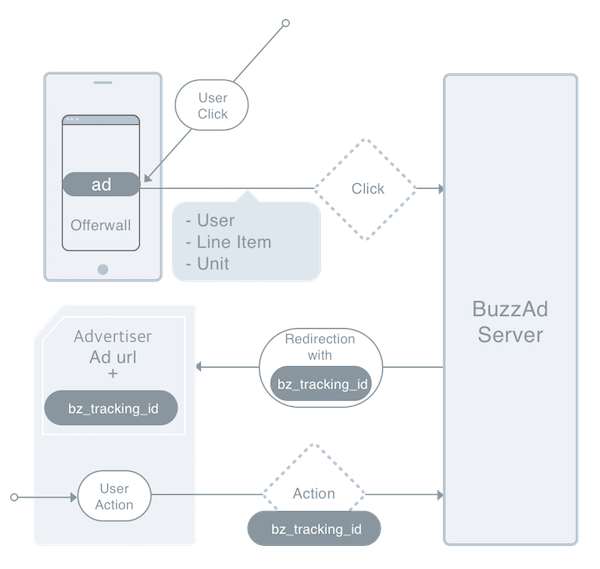

# BuzzAd Web Integration Guide

There are two options: Integration via Javascript and Server to Server Integration. Please select the preferred option according to your situation.

## 1. Javascript Integration

### Summary
You can integrate by inserting two kinds of Javascript codes provided below. Please call the first code (Initialization) when the first page of the ad is loaded, and the second step (Action Complete Signal) when the action is completed.

#### Caution!
- Javascript integration uses localStorage, so the domain of initial landing page and the action completed page must be the same. If not, please use the Server to Server integration.
- Please notify the Buzzvil manager after completing the integration test at the bottom of the document.
- If the integration test fails, please refer to the FAQ of the failed stage.
- During the integration test, please proceed to Step2 after successfully testing Step1.

#### Ad Reward Payment Flow

- When the user flows into the advertiser's ad through BuzzAd inventory, BuzzAd server adds `bz_tracking_id` parameter to the original landing url in order to track the user's action. 
    
    > Caution: `bz_tracking_id` is not a fixed value, but changes every time the user clicks the ad.

- Step1 Through 'Initialization' step integration, the parameter is stored in the localStorage of the advertiser's domain on the user's web browser.
- Step2 Through 'Action Completed Signal' step integration, the `bz_tracking_id` is sent with the action complete signal to BuzzAd server.
- With the `bz_tracking_id` it received, BuzzAd server finds the information of the user who participated in the ad and rewards the user.



### Step1 : Initialization

Please insert the javascript code below in the first page of the ad's landing page. 

> If `bz_tracking_id` parameter exists in the current url's search query, the code below stores it in the localStorage in the name of BuzzAd.

```javascript
<script>
	if (/bz_tracking_id/.test(location.search)) { localStorage.BuzzAd = location.search }
</script>
```

#### FAQ
- Q. As the code has the word 'test' in it, it seems like it's an example code. Do I have to edit it when integrating?
    
    > It is not an example code but a kind of regular expression. Please use the whole script without any change.

- Q. The initialization script is definitely inserted, and I checked the script being executed, but the integration test provided returns Step1 failure.
    
    > Please check if the page you worked on has the same url as the ad landing page. <br> If the landing page immediately redirects to another page, you might be working on another page else than the landing page URL Buzzvil manager received. <br> `bz_tracking_id` is only passed to the very first landing page. So the script MUST be executed on the landing page; if not, the tracking id would be considered not delivered and the test can return failure. <br> If the page you are working on and the landing page is unidentical, please either work on the landing page you delivered to Buzzvil manager or notify the manager with a new landing page url.

### Step2 : Action Completion Signal

After the action defined in the ad (such as signup, participation on an event, etc) is completed, please call the following javascript code.

> The code below calls the variable in the name of BuzzAd which was saved in the preceding stage and passes it to the server. By passing this value, BuzzAd server can check that the user participated through Buzzvil's ad and successfully completed the action, rewarding the user.

```javascript
<script>
(function (img) { img.onload = function () {
	var length = localStorage.BuzzAd.length;
    if(localStorage.BuzzAd.indexOf('10023_71ffbffd-ccf1-4edf-9c4c') != -1){
        alert("[Success] Action Completed!");
    };
    //*Please redirect here if needed*
};
if (localStorage.BuzzAd == null) { localStorage.BuzzAd = ""; }
img.src = "//track.buzzvil.com/action/pb/cpa/default/pixel.gif" + localStorage.BuzzAd; }) (new Image())
</script>
```
#### Caution! If you are redirecting after action completion
Redirecting code MUST be inserted after the action completion signal is sent to BuzzAd server. The comment code in the upper code block is inside the function called after the signal is sent; redirection will be successfully done if inserted in that part.

> The function in the code will always be called whether someone participated the ad through BuzzAd or not, so there's no need to redirect in another position. Rather, action completion signal might not be sent to BuzzAd at all if you insert the redirection code in a separate position.

#### FAQ
- Q. In the action completion signal code (Step2), it seems to show an alert if successfully called. How should I edit the code to hide it from general users?
    
    > The alert only shows when you are testing, so general users won't see the alert.

- Q. I definitely checked the action completion code being executed, but no alert is called. It seems the integration failed.

    > 1) First of all, please check if the domain of first landing page and action completion page is the same. (including http/https) <br> 2) If the domain is identical, please check if redirection or auto-close-window code is called before the action completion code. Those codes MUST be called in the commented section. (Please refer to the explanation about redirecting after action completion.)

**Caution** Please test on mobile devices; the alert might not work on certain mobile web browsers.

### Javascript Integration Test

In the link below, please add `Buzzad integration test` link to bookmark and proceed with the test. Details on the test procedure is explained in the linked page.

[Javascript Integration Test Page](https://cdn.rawgit.com/Buzzvil/buzzad-web-integration/master/integration_test_EN.html)

#### How to Add a Link to Bookmark
- In the browser preferences, please set the bookmarks bar to always appear. (The following image is the example of Chrome browser.)
- Drag the link and add it to the bookmarks bar.

## 2. Server to Server Integration (Not need if using Javascript integration) 
 
### Action Completion API
If the user successfully completes a certain action, please notify BuzzAd server. Please follow the guide below.
 
1) Request Direction

Advertiser → Publisher
 
2) HTTP Request method

POST or GET
 
3) HTTP Request URL

https://track.buzzvil.com/action/pb/cpa/default/

4) HTTP Request parameters

| Field | Type | Description |
| --- | --- | --- |
| `bz_tracking_id` | String | id to track the ad and the user. Delivered through the landing page URL. The webpage of the ad must store this value and pass it back to BuzzAd server when calling action completion API. |
 
5) Response

return in JSON format
		
| Field | Type | Description |
| --- | --- | --- |
| `code` | Integer | Result Code<br>- 200 : OK<br>- 9020 : Duplicated Request<br>- Others : Error |
| `msg` | String | Result Message |
 
6) Test bz_tracking_id

bz_tracking_id = 10023_71ffbffd-ccf1-4edf-9c4c
 
eg) https://track.buzzvil.com/action/pb/cpa/default/?bz_tracking_id=10023_71ffbffd-ccf1-4edf-9c4c

> If you are confronting technical issues during integration, please contact [Tech Support Team](mailto:tech-support@buzzvil.com) .

## 3. Guide Update History
 
| Version | Date | Content | Person in charge |
| --- | ------ | -------|------|
|1.0|2013/07/29|-		| Jueun Seo |
|1.1|2013/08/01|-		| Jueun Seo |
|1.2|2014/01/08|- Specify test campaign_key, session_key | Jueun Seo |
|2.0|2014/07/03|- Add Javascript integration guide | Jueun Seo |
|2.1|2014/07/16|- Fix Javascript code copy&paste issue | Jueun Seo |
|2.2|2014/07/17|- Fix bug in Javascript code | Jueun Seo |
|3.0|2014/11/03|- Replace server toAdfit | Jueun Seo |
|3.1|2014/12/13|- Change domain to buzzad.io<br>- Add detailed explanation<br>- Fix action completion Javascript code | Jueun Seo |
|3.2|2016/01/21|- Add detailed explanation<br>- Add Google Extension for Javascript integration test | Seojung Hong |
|3.3|2016/06/13|- Add detailed explanation<br>- Add test script and test page<br>- Add FAQ <br>- Edit overall flow of document | Seojung Hong |
|3.4|2017/09/08|- Add guide in Japanese | Seojung Hong |
|3.5|2017/10/13|- Change domain: t.buzzad.io -> track.buzzvil.com | Mir Lim |
|3.6|2018/05/21|- Add guide in English | Jeen Yoon |

